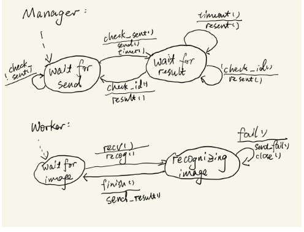
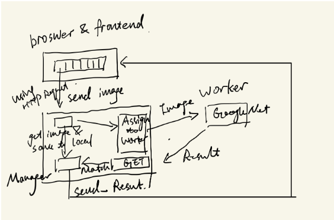
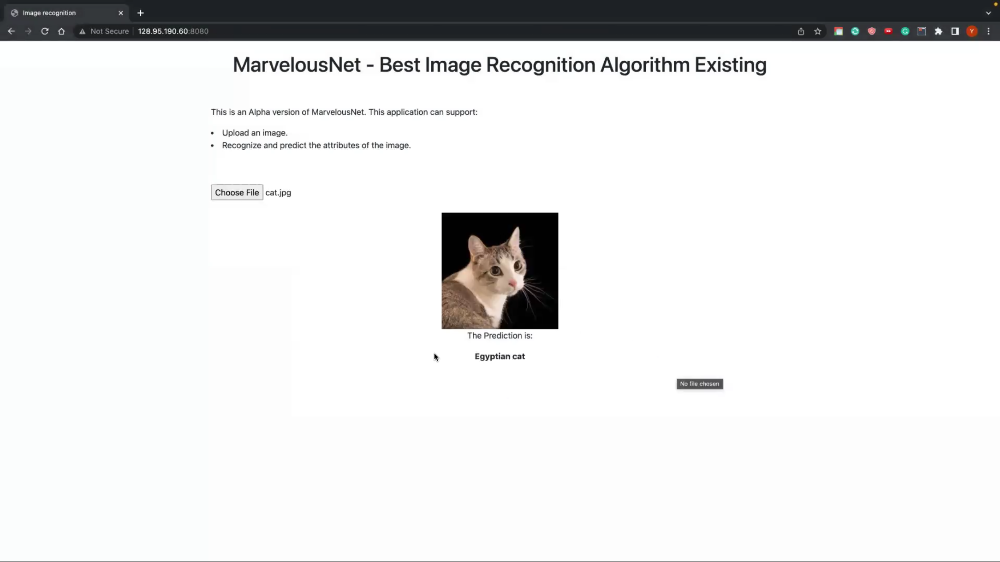
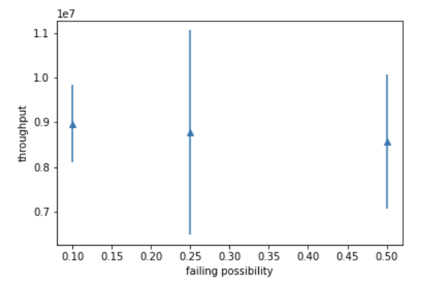
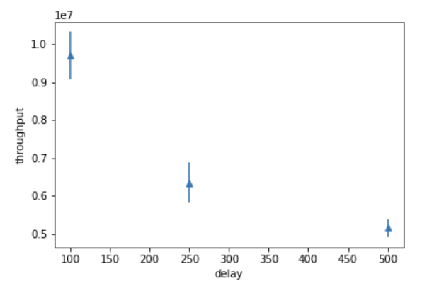
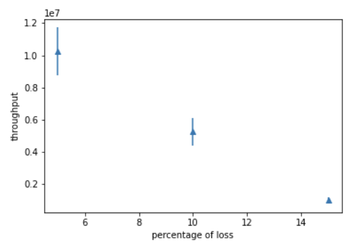

# Marvelous Net
## Division of Labor:

- **Dayong Wu**: Designed the communication protocol between frontend and manager, and implemented their socket connections. Realized the image & text uploading and receiving mechanism. Developed the frontend application using HTML and JavaScript.

- **Yan Tong**: Implementation of the sockets connection between manager and workers, the communication protocol between manager and worker. Backend programming with the Flask framework written in Python, implementation of workers, base code of socket, design of protocol between the manager and the worker. GENI nodes deployment.

- **Mao Mao**: Project framework design and scheduling. Design frontend applications using HTML, JavaScript, and React. Pin developing on HTML and JavaScript. Implementing the socket between frontend and the manager. Data gathering and report generating.

## Introduction

MarvelousNet is a web interface that allows clients to upload images to the browser and send image recognition queries to the server that provides the image recognition service. The front-end of the web page is implemented using HTML5 technology and Websocket, and the back-end manager gets the results and returns the response to notify the front end to update the results. The manager node (server) is responsible for assigning images to worker nodes and sending the results generated by the worker nodes back to the frontend. The learning outcome of this project is three-fold: how to develop web application using HTML5 and JS; how to use socket programming and REST API to communicate between nodes; how to design our own protocol based on the existing ones.

## Experimental Methodology

**Background:**
In this experiment, we will calculate the throughput with different images, different loss rates, different values of delay and in the case of worker node disconnection. Then we will draw the plot for the throughput and calculate the confidence interval.

**What we achieved:**
1. Full-stack programming with the HTML and JavaScript and Flask framework written in Python.
2. Socket programming 
3. Design of protocol between the manager and the worker 
4. Design of images recognition assignments on the worker node 
5. Use of deep learning API. 
6. Design of GENI nodes deployment. 
7. Evaluation of throughput based on loss, delay, node failure

**How do we fulfill the requirements?**
1. Using HTML and JavaScript to create a basic web interface for uploading images.
2. Using GoogleNet on worker Node to do image recognition.
3. Manager and frontend are on one Node and the web interface and the recognition systems are on separate nodes.
4. Using REST API to communicate between frontend, the manager, and workers.
Communication protocol and assignment system

**Communication protocol and assignment system**

<div style="display: flex">
<figure>
    
    <figcaption style="text-align: center;">FSM of Communication protocol</figcaption>
</figure>
<figure>
    
    <figcaption style="text-align: center;">Architecture of Assignment system</figcaption>
</figure>
</div>

**Assumption**:

- We experiment with 3 different values for each parameter, and we do 8 experiments with the same parameter values to calculate the mean value of the throughput.

- The unit of throughput is bps in the report.

## Result

### Preparation

1. Use **mini-project.xml** rspec file to create GENI nodes    
2. Log in node **manager**:

   Use these commands to **download everything** and **start server directly** by the automated script:

   ```bash
   curl -o manager.zip https://codeload.github.com/Superkakayong/MarvelousNet/zip/refs/heads/master
   unzip manager.zip
   ```

   Use `ls` to check the folder name starts with `MarvelousNet-master`, and then

   ```bash
   cd ./MarvelousNet-master*
   sh ./oobe.sh
   ```

3. Log in nodes **worker**:   
   
   use these commands to **download code and install packages** by the automated script:
   
   ```bash
   wget https://raw.githubusercontent.com/Superkakayong/MarvelousNet/master/worker/worker_prerequisite.sh
   sh ./worker_prerequisite.sh
   ```

### Run Services

4. In **manager**:

   If the manager is not running, use this command.

   `sh ./manager/run_server.sh`    
5. In **worker**:

   `sudo python3 -m worker.py 0 10.10.1.1`    

6. With the manager and worker running, open a browser and use the URL given in the manager to upload the image.   

### Note   
1. Operation Video: 
[](https://drive.google.com/file/d/1IKpR6r3nQ2MJrzjYgmSrdCZ8EPD-4j5E/view?usp=share_link)

2. You can login to our project directly using the server URL (http://128.95.190.58/8080), as we use TMUX to run our project on GENI continuously.

3. We provide a sample image ([`download.jpg`](./download.jpg)) for you to test.


## Results

#### Throughput as a function of node failing

Failing probability: [0.5, 0.25, 0.1]

Other Parameters: loss 0, delay 0

<div style="display: flex">
<figure>
    
</figure>
</div>

|                 | Mean throughput | std         | 95 lower confidence interval | 95 upper confidence interval |
| --------------- | --------------- | ----------- | ---------------------------- | ---------------------------- |
| 0.5 probability | 8571530.38     | 1493294.295 | 8123594.71                  | 8843256.30                  |
| 0.25 probability | 8771851.25     | 2878587.967 | 8529312.24                  | 8938541.42                  |
| 0.1 probability | 8970281.25     | 871470.884 | 8810434.52                  | 9093854.65                  |

#### Throughput as a function of delay

delay: [500ms, 250ms, 100ms]

Other Parameters: loss 0, probability of node failure 0

<div style="display: flex">
<figure>
    
</figure>
</div>

|       | Mean throughput | std         | 95 lower confidence interval | 95 upper confidence interval |
| ----- | --------------- | ----------- | ---------------------------- | ---------------------------- |
| 500ms | 5147536.875 | 236069.138 | 5021335.625 | 6176872.017
| 250ms | 6346498.625 | 536127.720 | 5998243.177 | 7391865.517
| 100ms | 9697021.58 | 625901.5582 | 8977828.422 | 10118324.633

#### Throughput as a function of loss rate

Loss rate: [ 5% , 10%, 15%]

Other Parameters: delay 0, probability of node failure 0

<div style="display: flex">
<figure>
    
</figure>
</div>

|                | Mean throughput | std         | 95 lower confidence interval | 95 upper confidence interval |
| -------------- | --------------- | ----------- | ---------------------------- | ---------------------------- |
| 5% loss  rate | 10248063.75 | 1477191.326 | 10223261.81 | 10271956.25 
| 10% loss  rate | 5262429.625 | 845658.1444 | 5231873.69 | 5293562.125
| 15% loss  rate | 1002189.625 | 201366.411 | 1000217.48  | 1005428.122

# Conclusion

In this project, we have evaluated the application performance in terms of loss rate, delay, and fault tolerance. By analyzing the data we get from the experiment, we can conclude that the network performance of our application can be affected by loss rate, delay, and the probability of worker connection failing. A possible extension to the project is that we can increase the overall performance by improving each worker node's performance so that the whole cluster's performance is improved.